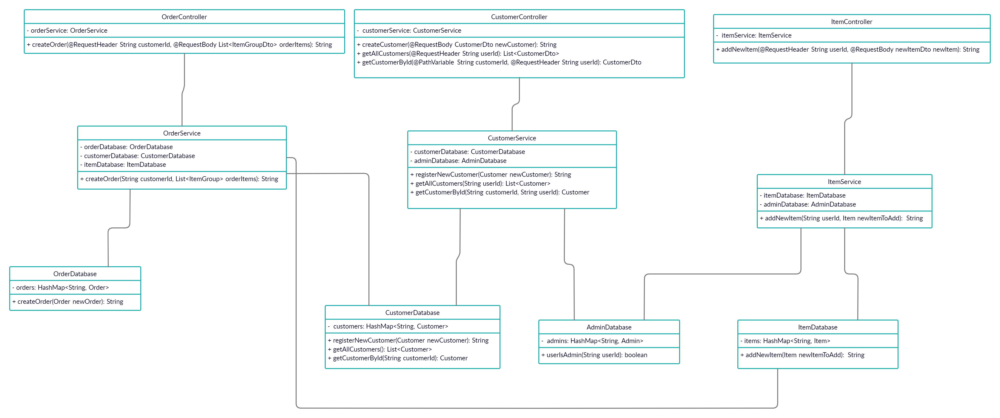

# eurder-spring-boot
## Story progression:
* Must-have's:
   - [X] Story 1
   - [X] Story 2
   - [X] Story 3
   - [X] Story 7
   - [X] Story 8
   - [X] Refactored stories above
   - [ ] Update old UML diagram
- Nice-to-have's:
   - [ ] Story 5
   - [ ] Story 10
   - [ ] Story 4
   - [ ] Story 9
   - [ ] Story 6

## UML diagrams
### Basic must-have's
 
